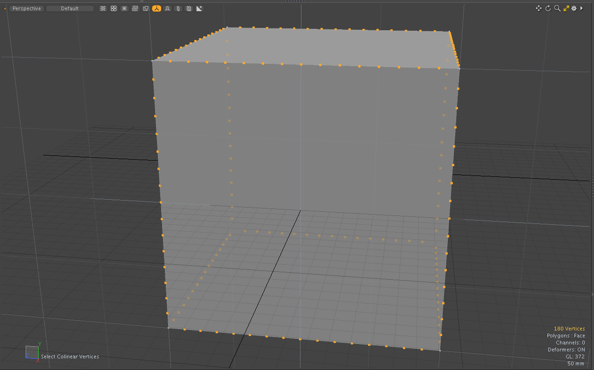
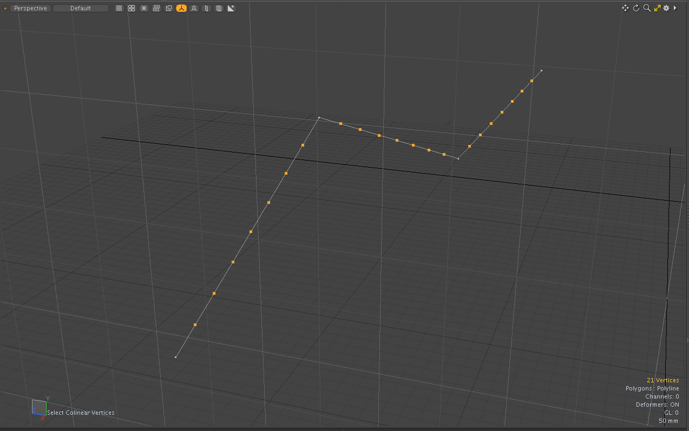
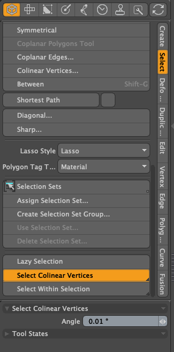

# Select Colinear Vertices tool for Modo plug-in

Select Colinear Vertices selects colinear vertices.  

Colinear Vertices selects vertices where the angle of the connected edge (the angle between two edges) is less than or equal to a specified angle. This tool works not only on the edges of surface polygons but also on the vertices of polylines. Additionally, if a morph map is selected, the edge angle is calculated using the coordinate values ​​of the vertices to which the morph map is applied. 

Hauling LMB on 3D view adjusts Angle value. 

This kit contains a direct modeling tool for Modo macOS and Windows.

## Installing

- Download lpk from releases. Drag and drop it into your Modo viewport. If you're upgrading, delete previous version.

## How to use Select Colinear Vertices tool

- The tool version of Select Colinear Vertices can be launched from **Select Colinear Vertices** button on **Select** tab of **Model** ToolBar on left.

## Basic Usage with Select Colinear Vertices tool

- Activate **Select Colinear Vertices** button on **Select** tab of **Model** Modo toolbar.
- Lasso elements within selections on 3D view.

